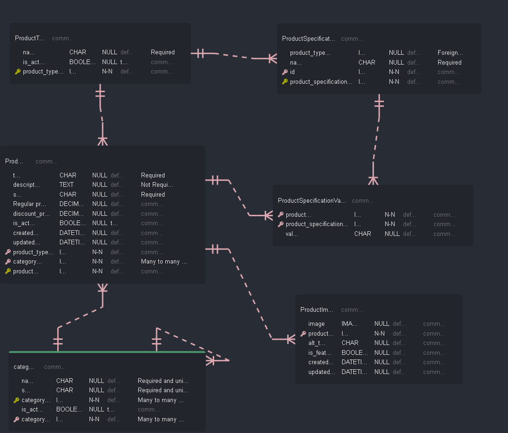

# ECOMMERCE 

1. [run project](#run-project)

## Run Project
* ###### Requirements:
     I use `pipreqs ` library for create requirements.txt
     ```text
      pip install pipreqs
      pipreqs my_path
     ```
     If this file already exists, you must use:
     ```text
      pipreqs --force
     ```
* ###### Database for product model
    use `https://vuerd.github.io/` website
    
    and use `https://asciiflow.com/` for:
    ```text
         ┌─────────────────────┐
         │                     │
         │                   ┌─┼─┐
    ┌────┴────────┐      ┌───┴─┼─┴────┐  xxxxx       xxxxxx
    │             │      │     │      │ xx   xx   xxxx   xx
    │             │      │  product   │ x     xxxxx      xx
    │             │      │            │xx       x        xx
    │    product  │      │  image     │ x               xx
    │             │      │            │ xx             xxx
    │             │      │  alt_text  │  xxx           xx
    │             │      │            │   xx          xx
    │             │      │  is_feature│     xx       xx
    │             │      │            │      xxx    xx
    │             │      │  create_at │        xxxxx
    └─────────────┘      └────────────┘          xx
    ```
  
     
